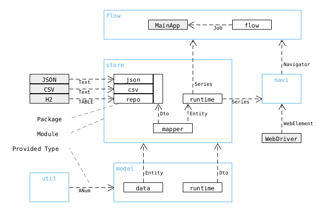
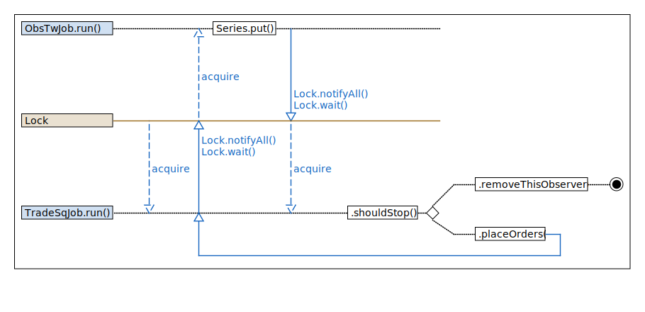

# Abricore

## About

* A `JPA` / `POJO` / `Selenium` investing bot.
* It has `Services` which hold runtime data.
* And `Jobs` which move data between resources, such as:
    * `DB` / `WEB` / `CSV`.
* see also `./doc/*`

## Queries

* See also `MainApp` for query listeners, or use the web-ui (http://0.0.0.0:24002/)

## Generic Template

If we were to add a new `Service` we would need to implement the blue Template Objects. +
If adding a `Job` implement the red Template Object instead.

## Modules

Here is an overview of the modules and the types they exchange.

| Component             | Description                                       |
|-----------------------|---------------------------------------------------|
| `flow`                | Application flow & logic.                         |
|                       | - Issues start/stop commands to `Job`.            |
|                       | - Issues fetch/interrupt commands to `Navigator`. |
|                       | - Issues update/stop commands to `Series`.        |
| `navi`                | Adapter towards Web & Selenium.                   |
| `store.runtime`       | Runtime data holder.                              |
| `store.json/csv/repo` | Adapter towards CSV & H2 & JSON.                  |
| `model.runtime`       | Runtime types.                                    |
| `model.data`          | Storage entities.                                 |
| `util`                | Common types & helpers.                           |

## Logic Flow

The image below shows the flow between `Stores` and `Services`:

## Lock Flow

## Particularities

### `Dao` vs `SlimDao`

#### Problem

* `SymbolDao` can *not* init its `AssetDto` fully, as this would require dep to `AssetService`.

- this would cause a circular dep.
- to show this `SymbolDao` is a `SlimDao`.
- instead, we place the custom init logic for `AssetDto` in the constructor of `AssetService`.
- this is _ok_ as long as `SymbolDao` is called from `AssetService` only.

* The remaining dao, e.g. `SnapShotDao`, init their dtos fully and thus are "full"-`Dao`.

## Runtime Lifecycle

#### OptionDto

The OptionDto Lifecycle has two stages.

1. *Discovery:*
   According to our strategy we fetch a list of viable options.
   However, this data set is missing some crucial entries.
   We mark these options as `FOUND`.
2. *Details:*
   For each `FOUND` option, we fetch the missing fields.
   We then mark the options as `KNOWN`.
3. *Death:*
   Options may expire or be knocked out.
   When we fail to fetch a quote for an option, we mark the options as `DEAD`.

[%header]
|###
| | fetchOptions() | fetchAssetDetails() | fetchOrDead()
| underlying 3+| ✔️
| strike 3+| ✔️
| expiry | 2+| ✔️
| ratio | 2+| ✔️
| optionType 3+| ✔️
| status | `FOUND` | `KNOWN` | `DEAD`
| assetType | 2+| ✔️
| name 3+| ✔️
| twSymbol | | |
| sqIsin 3+| ✔️
| currency 3+| ✔️
| exchange 3+| ✔️
|###

