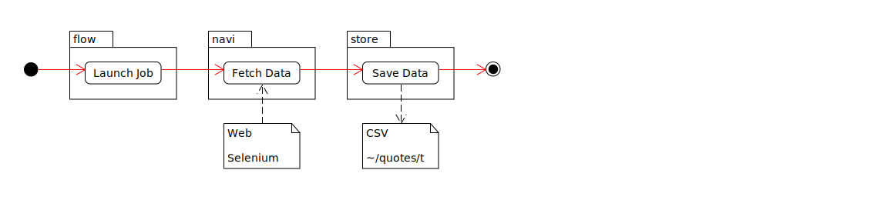
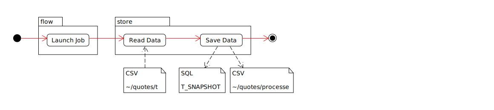
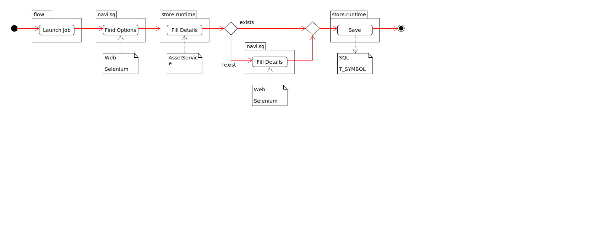
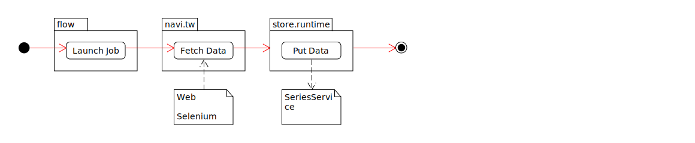
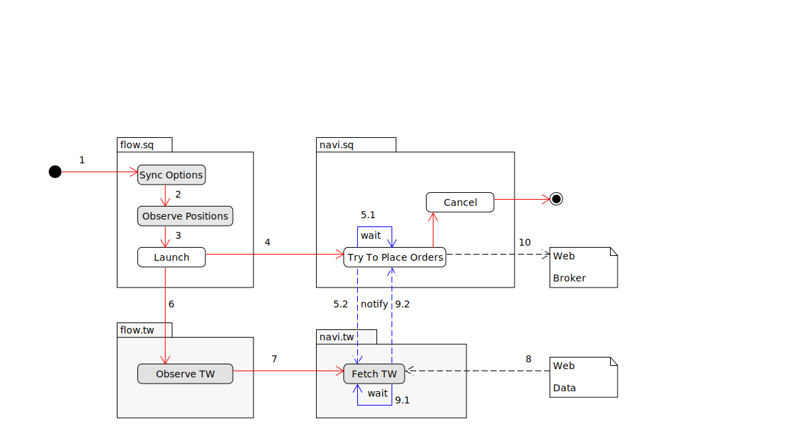

= Jobs+Tasks
:toc:
:toclevels: 5
:stylesheet: ../../shared/adoc-styles.css

== Disambiguation
* `Job` : a `Runnable` that loops while it is not cancelled.
* `Task` : a `Runnable` that is executed once.

== Jobs

=== Dependencies
Dashed line indicate a _business_ dependency - i.e. for _service B_ to meaningfully run, it requires data that is provided by _service A_.

Full lines indicate a _runtime_ dependency - i.e. for _service B_ to procced it's run loop, it must be triggered by _service A_.

image::../img/job-dep.svg[,80%]

{empty} +

=== List of Jobs

==== 1. Download Historical Data : `dl-tw`

[cols="1,3",width="60%"]
|===
| Input | Webdriver
| Output | CSV
| Used by | -
| Components | `read-tmp-csv-to-db`
| Last Checked | 2024-03-24
|===

{empty} +

==== 2. Read Tmp CSV To DB : `read-tmp-csv-to-db`

[cols="1,3",width="60%"]
|===
| Input | CSV
| Output | DB Table Content
| Used by | `dl-tw`
| Components | -
| Last Checked | 2024-03-24
|===

===== 3. Sync Options SQ : `sync-opt-sq`

* Goal: Fetch the currently applicable Options and/or update the data.

[cols="1,3",width="60%"]
|===
| Input | Webdriver
| Output | `AssetService`
| Used by | `obs-pos-sq`
| Components | -
| Last Checked | 2024-03-24
|===

===== 4. Observe Positions SQ : `obs-pos-sq`

[cols="1,3",width="60%"]
|===
| Input | Webdriver
| Output | `AssetService`
| Used by | ?
| Components | `sync-opt-sq`
| Last Checked | 2024-03-24
| Description | Observe Positions & Transactions.
|===

image::../img/job-flows/obs-pos-sq.svg[,120%]

{empty} +

===== 6. Observe TW : `obs-tw`  🆗
* _TODO_ async lock not yet tested.

{empty} +

===== 7. Trade SQ : `trade-sq`
* *IMPORTANT*
- `TradeSqJob.checkStop()` is a preemptive shutdown guard.
Will check if:
** Will check if current job operates withing `StrategyDto.from` / `.to`

{empty} +

===== 8. Paper Job

Simulate Trade Job with historical data.

{empty} +

===== 9. Exit : `e`

===== 10. Patch: `patch` ✔️
* Patches the gaps in data.
See also _Data Conventions_.

== Tasks
