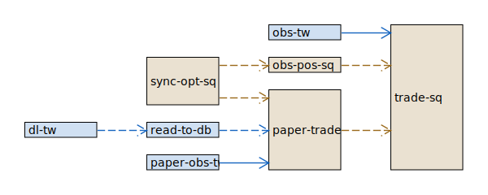
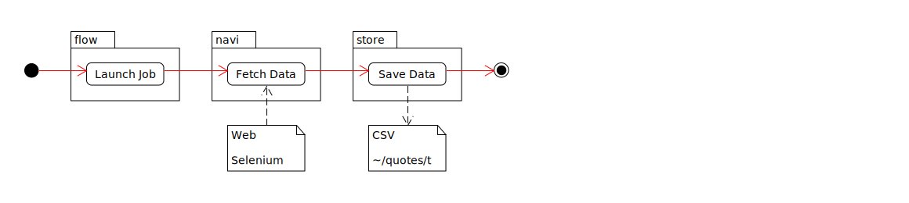
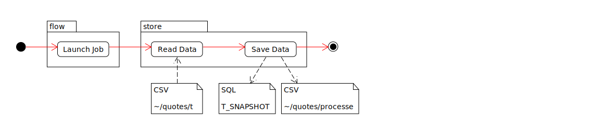
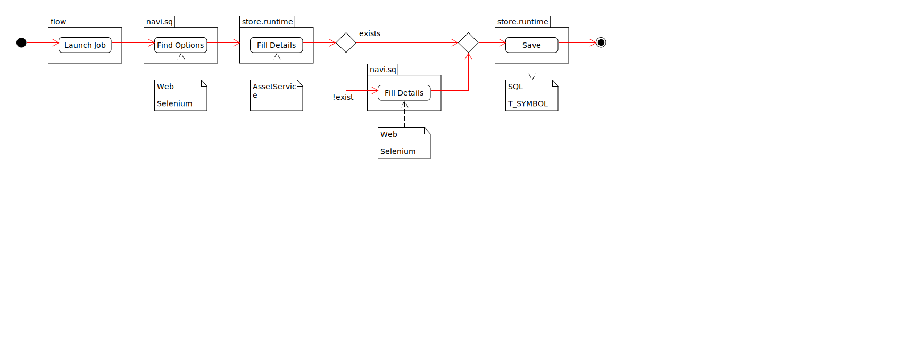
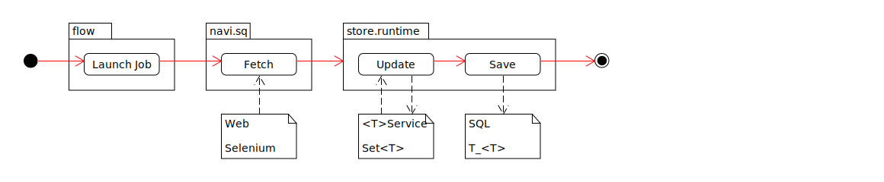
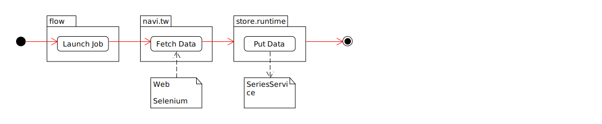
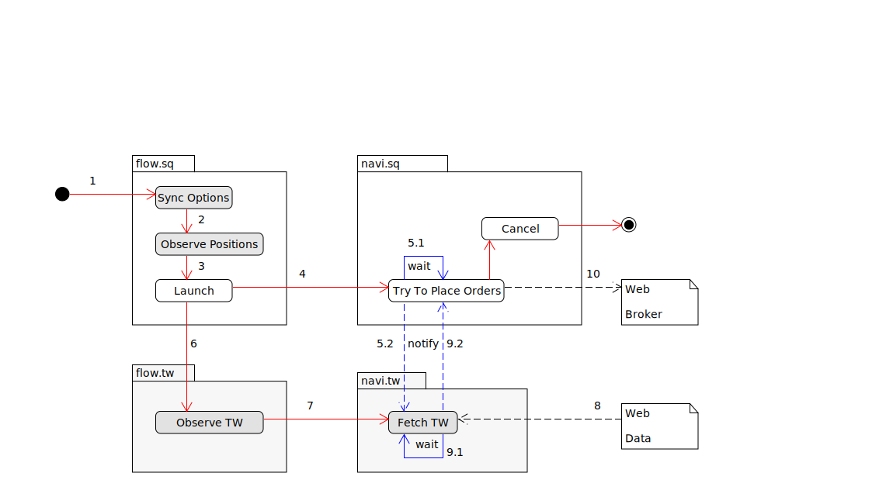
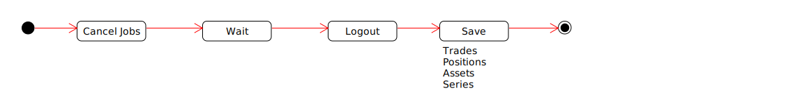

= Jobs
:toc:
:toclevels: 5
:stylesheet: ../../shared/adoc-styles.css

== Jobs

==== Dependencies
Dashed line indicate a _business_ dependency - i.e. for _service B_ to meaningfully run, it requires data that is provided by _service A_.

Full lines indicate a _runtime_ dependency - i.e. for _service B_ to procced it's run loop, it must be triggered by _service A_.

{empty} +

== List of Jobs

{empty} +

===== 1. Download Historical Data : `dl-tw` ✔️

* Expected result:
** csv files

{empty} +

===== 2. Read Data To DB : `read-to-db` ✔️
* Depends on `dl-tw`.

===== 3. Sync Options SQ : `sync-opt-sq` ✔️

===== 4. Observe Positions SQ : `obs-pos-sq` ✔️
* Depends on `sync-opt-sq`.
* Observe Positions & Transactions.

{empty} +

===== 6. Observe TW : `obs-tw`  🆗
* _TODO_ async lock not yet tested.

{empty} +

===== 7. Trade SQ : `trade-sq`
* *IMPORTANT*
- `TradeSqJob.checkStop()` is a preemptive shutdown guard.
Will check if:
** Will check if current job operates withing `StrategyDto.from` / `.to`

{empty} +

===== 8. Paper Job

Simulate Trade Job with historical data.

{empty} +

===== 9. Exit : `e`

===== 10. Patch: `patch` ✔️
* Patches the gaps in data.
See also _Data Conventions_.
