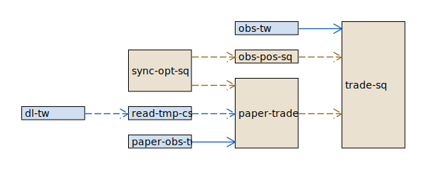
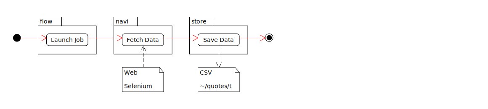
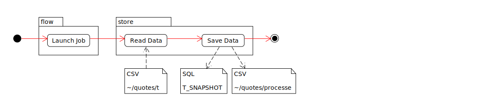
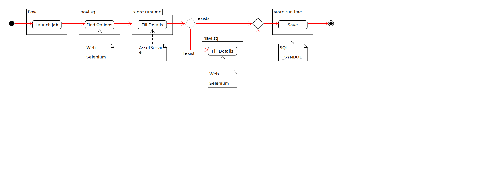
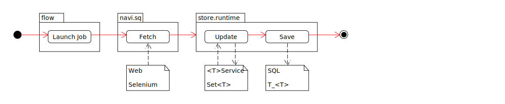

# Jobs+Tasks

## Types

* `Job` : a `Runnable` that loops while it is not cancelled.
* `Task` : a `Runnable` that is executed once.

## Lifecycle

* `ready` :
    * set by the job itself, to indicate it is ready to be consumed
    * used by dependants
* `cancelled` : used by `main` to indicate _terminate upon completion of next loop_

## Jobs

### Dependencies

Dashed line indicate a _business_ dependency

- i.e. for _service B_ to meaningfully run, it requires data that is provided by _service A_.

Full lines indicate a _runtime_ dependency

- i.e. for _service B_ to procced it's run loop, it must be triggered by _service A_.

### List of Jobs

#### dl-tw

- Download Historical Data

| Input        | Webdriver            |
|--------------|----------------------|
| Output       | CSV                  |
| Used by      | -                    |
| Components   | `read-tmp-csv-to-db` |
| Last Checked | 2024-03-24           |

#### read-tmp-csv-to-db

- Read Tmp CSV To DB

| Input        | CSV              |
|--------------|------------------|
| Output       | DB Table Content |
| Used by      | `dl-tw`          |
| Components   | -                |
| Last Checked | 2024-03-24       |

#### sync-opt-sq

- Sync Options SQ
- Goal: Fetch the currently applicable Options and/or update the data.

| Input        | Webdriver      |
|--------------|----------------|
| Output       | `AssetService` |
| Used by      | `obs-pos-sq`   |
| Components   | -              |
| Last Checked | 2024-03-24     |

#### obs-pos-sq

- Observe Positions SQ

| Input        | Webdriver                         |
|--------------|-----------------------------------|
| Output       | `AssetService`                    |
| Used by      | ?                                 |
| Components   | `sync-opt-sq`                     |
| Last Checked | 2024-03-24                        |
| Description  | Observe Positions & Transactions. |

##### 6. Observe TW : `obs-tw`  🆗

* _TODO_ async lock not yet tested.

image::../img/job-flows/obs-tw.svg[,100%]

{empty} +

##### 7. Trade SQ : `trade-sq`

* *IMPORTANT*

- `TradeSqJob.checkStop()` is a preemptive shutdown guard.
  Will check if:
  ** Will check if current job operates withing `StrategyDto.from` / `.to`

image::../img/job-flows/trade-sq.svg[]

{empty} +

##### 8. Paper Job

Simulate Trade Job with historical data.

{empty} +

##### 9. Exit : `e`

image::../img/job-flows/exit-job.svg[]

##### 10. Patch: `patch` ✔️

* Patches the gaps in data.
  See also _Data Conventions_.

## Tasks
