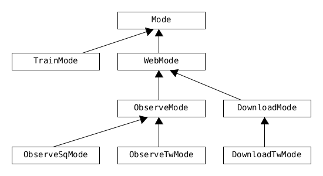

=== Flow

* `Main` is located here.
* Determines which `WebMode` the application is run in.

{empty} +

==== Modes

{empty} +

===== Generrally the Mode classes fullfill the following requirements: +

* hava a List of SnapShotSeries, which acts as a central point of access to the known data.
** SnapShotSeries are the static runtime containers for each known Asset/Interval combination.

{empty} +

===== How Asset are added to Mode
** in ObserveMode add Asset directly.
** in TradeMode set Mission, this will parse Asset from Mission.